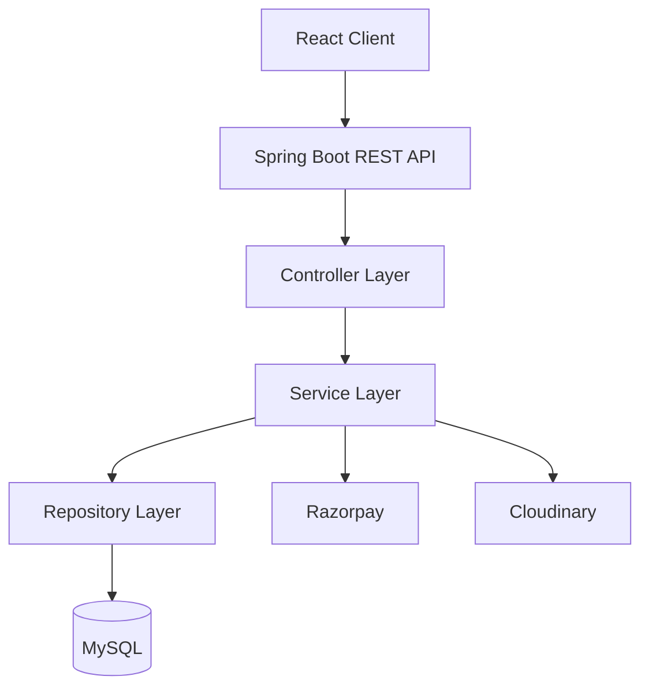
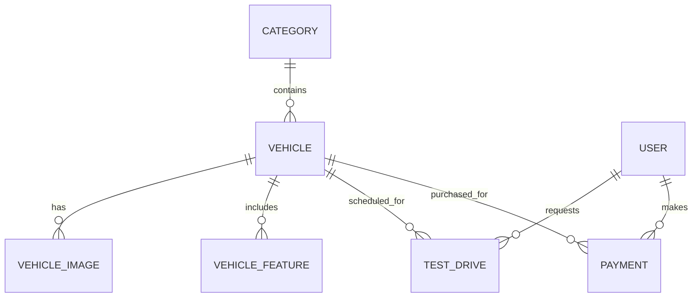

<div align="center">

# 🏎️ PulseDrive Motors

### Drive the Future. Own the Experience.

**A modern, full-stack automotive e-commerce platform for discovering, comparing and purchasing premium vehicles.**

<p>
  
  
  
  
</p>

<p>
  
  
  
  
</p>

</div>

---

## 🌟 Overview

**PulseDrive Motors** is a full-stack car dealership and automotive e-commerce platform designed to deliver a premium digital vehicle-shopping experience. Customers can explore vehicles, filter the catalogue, inspect specifications and images, request test drives and complete secure payments.

The backend follows a layered Spring Boot architecture with DTOs, mappers, services, repositories, validation and centralized exception handling. The frontend provides a modern, responsive interface focused on attractive vehicle presentation and simple customer journeys.

## ✨ Key Features

### 🚘 Vehicle Experience

- Browse premium vehicles with detailed specifications.
- Search and filter by brand, fuel type, body type, transmission and price.
- Sort catalogue results dynamically.
- View multiple exterior, interior and dashboard images.
- Explore performance, comfort, technology and safety features.
- Check price, discount, stock and availability.

### 🧑‍💼 Customer Experience

- View vehicle details through a responsive interface.
- Request and manage vehicle test drives.
- Complete secure payments using Razorpay.
- Access vehicle and booking information through REST APIs.

### 🛠️ Administration

- Create, update and manage vehicle listings.
- Organize vehicles into categories.
- Manage images and vehicle-specific features.
- Control stock and availability.
- Track audit information such as creation and update timestamps.

### ☁️ Integrations

- **Razorpay** for secure online payments.
- **Cloudinary** for cloud-based vehicle image management.
- **MySQL** for reliable relational data persistence.

## 🧰 Technology Stack

| Area | Technologies |
|:---|:---|
| 🎨 Frontend | React, Vite, JavaScript, HTML5, CSS3 |
| ⚙️ Backend | Java 26, Spring Boot 4.1, Spring Web |
| 🗃️ Persistence | Spring Data JPA, Hibernate, MySQL |
| 🔎 Search | JPA Specifications and dynamic filtering |
| 💳 Payments | Razorpay |
| 🖼️ Media | Cloudinary |
| 🧪 Testing | JUnit, Mockito, Postman |
| 🔧 Build | Maven |
| 🔗 Communication | REST APIs and JSON |

## 🏗️ Architecture



The application separates presentation, business logic and persistence responsibilities:

- **Controller layer** exposes REST endpoints and validates requests.
- **DTO and mapper layer** protects entities and shapes API responses.
- **Service layer** implements business rules and orchestration.
- **Repository layer** provides database access and dynamic queries.
- **Exception layer** returns consistent and meaningful error responses.

## 📦 Core Modules

| Module | Responsibility |
|:---|:---|
| Category | Organizes vehicles into catalogue groups |
| Vehicle | Stores specifications, pricing, stock and availability |
| Vehicle Images | Manages exterior and interior media |
| Vehicle Features | Stores safety, comfort and technology features |
| Users | Maintains customer and administrative accounts |
| Test Drives | Handles customer test-drive requests |
| Payments | Integrates Razorpay payment workflows |

## 🔍 Vehicle Search

The catalogue supports combined, case-insensitive filters:

- Brand
- Fuel type
- Body type
- Transmission
- Minimum and maximum price
- Sort field and direction

Example request:

```http
GET /api/vehicles/search?brand=BMW&fuelType=Petrol&bodyType=Coupe&minPrice=10000000&maxPrice=16000000&sortBy=price&sortDirection=asc
```

## 🗄️ Data Model

The main relational structure includes:



## 📁 Suggested Project Structure

```text
PulseDrive-Motors/
├── backend/
│   ├── src/main/java/com/pulsedrive/
│   │   ├── controller/
│   │   ├── dto/
│   │   ├── entity/
│   │   ├── exception/
│   │   ├── mapper/
│   │   ├── repository/
│   │   ├── service/
│   │   └── specification/
│   ├── src/main/resources/
│   │   └── application.properties
│   └── pom.xml
├── frontend/
│   ├── src/
│   │   ├── assets/
│   │   ├── components/
│   │   ├── pages/
│   │   └── services/
│   └── package.json
└── README.md
```

## 🚀 Getting Started

### Prerequisites

- Java 26
- Maven 3.9+
- MySQL 8+
- Node.js 20+
- npm
- Git

### 1. Clone the repository

```bash
git clone <your-pulsedrive-repository-url>
cd PulseDrive-Motors
```

### 2. Create the MySQL database

```sql
CREATE DATABASE pulsedrive_db;
```

### 3. Configure the backend

Open `backend/src/main/resources/application.properties` and add your local configuration:

```properties
spring.datasource.url=jdbc:mysql://localhost:3306/pulsedrive_db
spring.datasource.username=YOUR_MYSQL_USERNAME
spring.datasource.password=YOUR_MYSQL_PASSWORD

spring.jpa.hibernate.ddl-auto=update
spring.jpa.show-sql=true
spring.jpa.properties.hibernate.format_sql=true

razorpay.key.id=YOUR_RAZORPAY_KEY_ID
razorpay.key.secret=YOUR_RAZORPAY_KEY_SECRET

cloudinary.cloud-name=YOUR_CLOUDINARY_CLOUD_NAME
cloudinary.api-key=YOUR_CLOUDINARY_API_KEY
cloudinary.api-secret=YOUR_CLOUDINARY_API_SECRET
```

> Never commit real database passwords, Razorpay secrets or Cloudinary credentials.

### 4. Run the backend

```bash
cd backend
mvn spring-boot:run
```

The API will normally start at:

```text
http://localhost:8080
```

### 5. Run the frontend

Open another terminal:

```bash
cd frontend
npm install
npm run dev
```

Open the URL displayed by Vite, normally:

```text
http://localhost:5173
```

## 🧪 Testing

Run backend tests:

```bash
cd backend
mvn test
```

Recommended API testing flow:

1. Create a category.
2. Add a vehicle and connect it to the category.
3. Add images and features to the vehicle.
4. Retrieve the full vehicle response.
5. Test combined search filters.
6. Submit a test-drive request.
7. Test the Razorpay order and verification flow in test mode.

## 📡 Example API Routes

| Method | Endpoint | Description |
|:---:|:---|:---|
| `GET` | `/api/categories` | List categories |
| `POST` | `/api/categories` | Create a category |
| `GET` | `/api/vehicles` | List vehicles |
| `GET` | `/api/vehicles/{id}` | Get one vehicle |
| `POST` | `/api/vehicles` | Create a vehicle |
| `PUT` | `/api/vehicles/{id}` | Update a vehicle |
| `DELETE` | `/api/vehicles/{id}` | Delete a vehicle |
| `GET` | `/api/vehicles/search` | Search and filter vehicles |
| `POST` | `/api/vehicles/{id}/images` | Add a vehicle image |
| `POST` | `/api/vehicles/{id}/features` | Add a vehicle feature |
| `POST` | `/api/test-drives` | Request a test drive |

> Adjust route names if your controller mappings differ.

## 📸 Screenshots

Add project screenshots to `docs/screenshots/`, then replace these placeholders:

| Home Page | Vehicle Catalogue |
|:---:|:---:|
|  |  |

| Vehicle Details | Admin Dashboard |
|:---:|:---:|
|  |  |

## 🛣️ Roadmap

- [x] Category management
- [x] Vehicle CRUD operations
- [x] Vehicle image management
- [x] Vehicle feature management
- [x] Dynamic vehicle search and filtering
- [x] Test-drive workflow
- [x] Razorpay integration
- [x] Cloudinary integration
- [ ] Role-based authentication and authorization
- [ ] Wishlist and vehicle comparison
- [ ] Customer reviews and ratings
- [ ] Order tracking and invoice generation
- [ ] Automated CI/CD pipeline

## 🔐 Security

- Store credentials in environment variables or secret managers.
- Use Razorpay test credentials during development.
- Validate and sanitize all incoming requests.
- Restrict administrative endpoints with role-based authorization.
- Never expose payment secrets in frontend code.

## 👨‍💻 Author

**Premkumar Bhadagave**  
B.Tech in Artificial Intelligence and Data Science  
Full-Stack Developer

## 🤝 Contributing

Contributions, issues and feature suggestions are welcome. Fork the repository, create a feature branch and submit a pull request.

## 📄 License

This project is intended for learning and portfolio demonstration. Add a suitable open-source license before redistribution.

---

<div align="center">

### ⭐ If you like PulseDrive Motors, give the repository a star!

**Built with ❤️, Java and a passion for automobiles.**

</div>
